# Guía de Usuario — Aplicación *Class Room App*

Bienvenido/a a la guía oficial de **Class Room App**, la aplicación móvil diseñada para facilitar la interacción entre estudiantes y docentes en la gestión de clases, evaluaciones, comunicación y seguimiento académico.

---

## Flujos Principales de la App

### Como estudiante
1. **Registrate o iniciá sesión** en la aplicación.
2. **Explorá los cursos** disponibles y elegí uno de tu interés.
3. **Inscribite** en el curso.
4. **Accedé a los módulos y recursos** del curso.
5. **Completá tareas y exámenes** asignados.
6. **Recibí retroalimentación** y consultá tus calificaciones.
7. **Participá en el foro** y usá el chat de asistencia si tenés dudas.

### Como docente
1. **Iniciá sesión** con tu cuenta de docente.
2. **Creá o gestioná tu curso**.
3. **Agregá módulos, recursos, tareas y exámenes**.
4. **Asigná docentes auxiliares** si es necesario.
5. **Revisá las entregas de los estudiantes** y brindá feedback.
6. **Consultá estadísticas** del progreso de tus alumnos.

## Tabla de Contenidos

- [Instalación de la App](#instalación-de-la-app)
- [Inicio de Sesión y Registro](#inicio-de-sesión-y-registro)
- [Pantalla de Inicio](#pantalla-de-inicio)
- [Gestión de Perfil](#gestión-de-perfil)
- [Gestión de Clases y Cursos](#gestión-de-clases-y-cursos)
  - [Exploración y Descubrimiento](#exploración-y-descubrimiento)
  - [Visualización y Gestión del Curso](#visualización-y-gestión-del-curso)
  - [Módulos y Recursos](#módulos-y-recursos)
  - [Gestión de Docentes Auxiliares](#gestión-de-docentes-auxiliares)
- [Tareas y Evaluaciones](#tareas-y-evaluaciones)
  - [Para Docentes](#para-docentes)
  - [Para Estudiantes](#para-estudiantes)
- [Comunicación](#comunicación)
  - [Foro y Chat de Asistencia](#foro-y-chat-de-asistencia)
- [Seguimiento y Análisis](#seguimiento-y-análisis)
- [Capturas de Pantalla](#capturas-de-pantalla)

---

## Instalación de la App

Escaneá el siguiente código QR para descargar la aplicación en tu dispositivo Android:

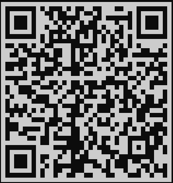

Actualmente disponible solo para Android.

---

## Inicio de Sesión y Registro

Desde esta sección podrás:
- Iniciar sesión si ya tenés una cuenta.
- Registrarte ingresando tu correo y una nueva contraseña.
- Acceder utilizando tu cuenta de Google.
- Recuperar tu contraseña si la olvidaste.

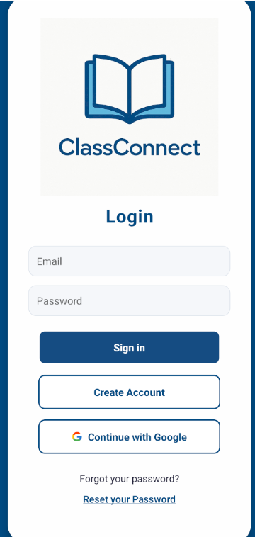

---

## Pantalla de Inicio

En la pantalla de inicio podés:
- Inscribirte a nuevos cursos.
- Acceder a tus actividades.
- Ingresar al foro y al chat de soporte con inteligencia artificial.
- Si sos docente, visualizar estadísticas de tus alumnos.

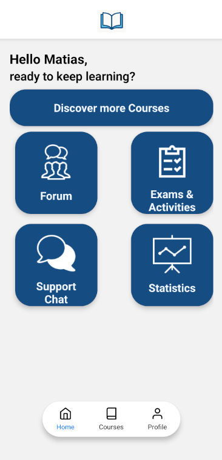

---

## Gestión de Perfil

- Consultá y editá tu perfil, accedé a la configuración y ajustá tus preferencias.

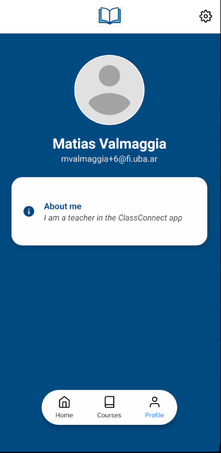

- Editá información personal, preferencias de notificaciones, activá o desactivá el acceso biométrico y cerrá tu sesión.

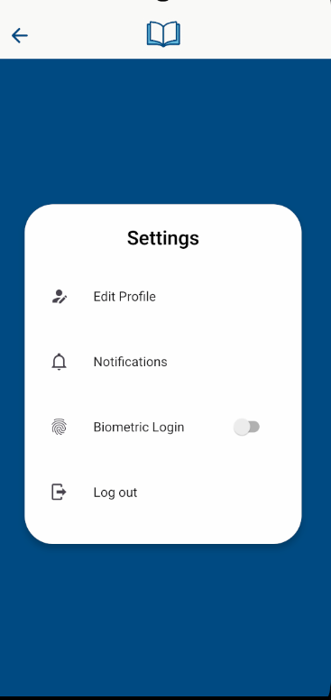

---

## Gestión de Clases y Cursos

### Exploración y Descubrimiento

Desde esta sección podés:
- Ver tus cursos favoritos.
- Consultar los cursos en los que estás inscripto.
- Acceder al historial de cursos completados.
- Si sos docente, ingresar a la gestión de tus cursos.

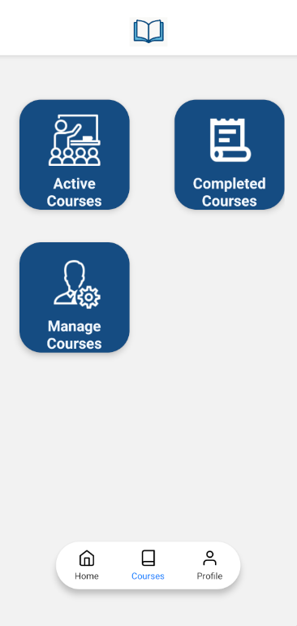

Además, podés buscar y filtrar cursos en el listado general.

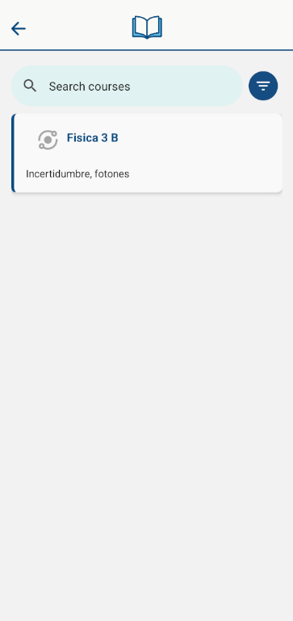

### Visualización y Gestión del Curso

- Inscribite a un curso desde la pantalla de detalles.

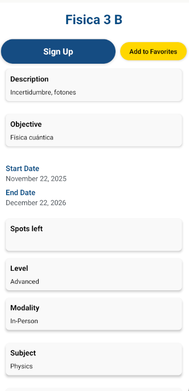

- Una vez inscripto, accedé a los detalles del curso y los módulos disponibles.

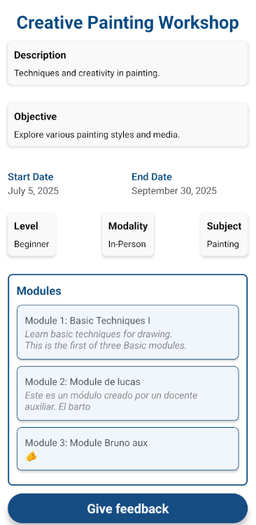

- Si sos docente, gestioná el curso: asigná docentes auxiliares y consultá el listado de estudiantes inscriptos.

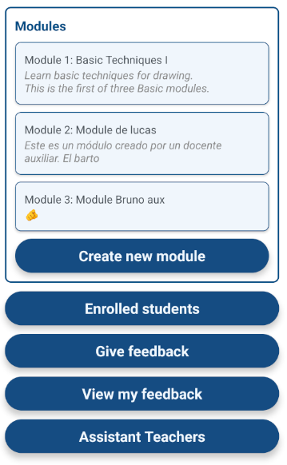

### Módulos y Recursos

- Accedé y navegá los módulos y recursos del curso tanto como estudiante como docente.

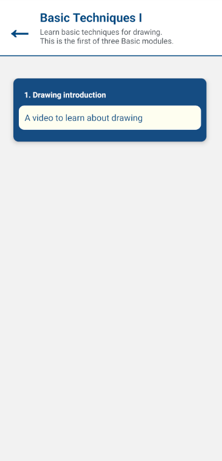

- Los docentes pueden crear, editar y eliminar módulos y recursos.

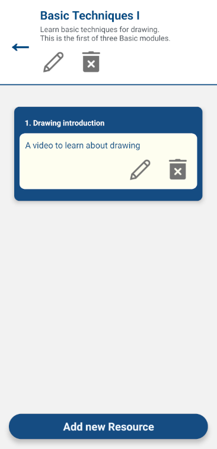

### Gestión de Docentes Auxiliares

Los docentes pueden asignar y gestionar ayudantes de curso.

También pueden consultar el historial de actividades de los auxiliares.

---

## Tareas y Evaluaciones

### Para Docentes

- Crear tareas y exámenes.
- Visualizar entregas de estudiantes.
- Brindar retroalimentación y calificaciones.

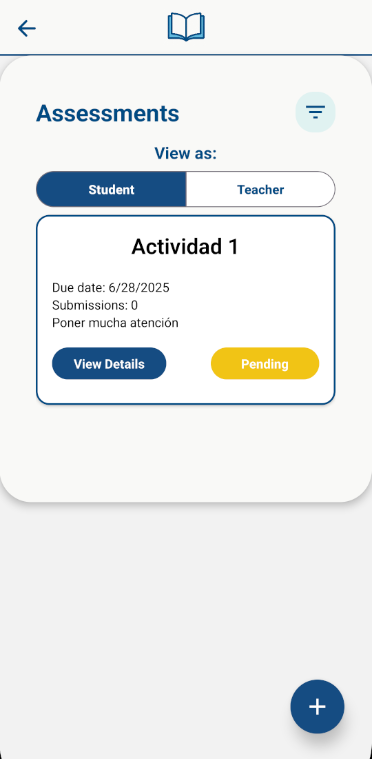
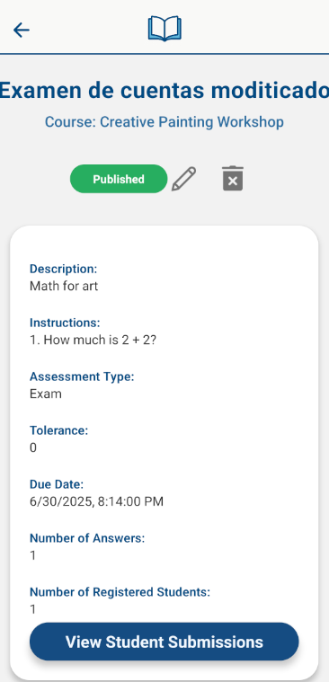
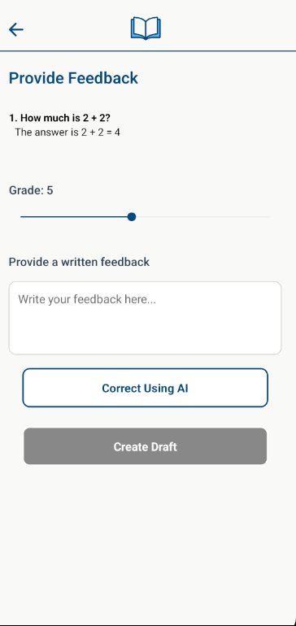
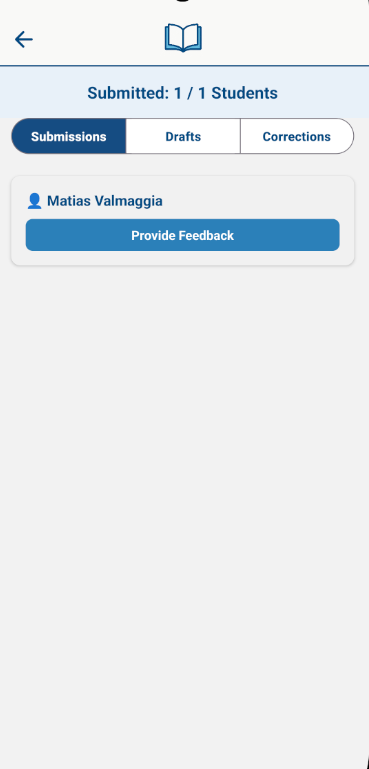

### Para Estudiantes

- Consultar tareas y exámenes asignados.
- Realizar y enviar entregas desde la app.

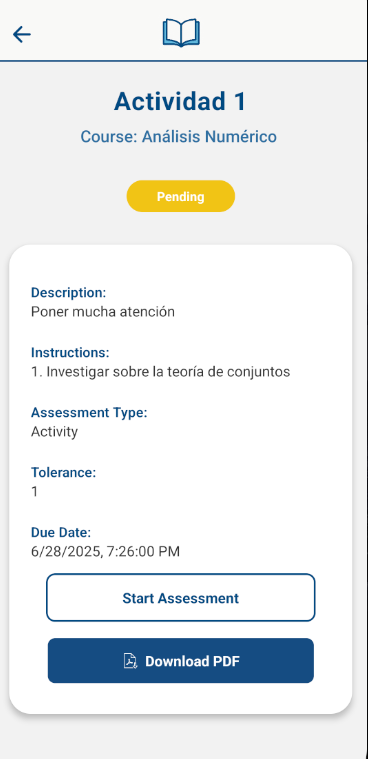

---

## Comunicación

### Foro y Chat de Asistencia

- Participá en foros de preguntas: creá nuevas consultas y respondé a tus compañeros.

- Utilizá el chat de asistencia para recibir ayuda automática con inteligencia artificial.

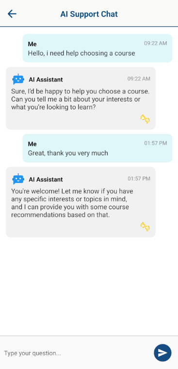

---

## Seguimiento y Análisis

Consultá estadísticas de desempeño, progreso y calificaciones de los alumnos. Podés visualizar la información de forma global, por curso o por estudiante.

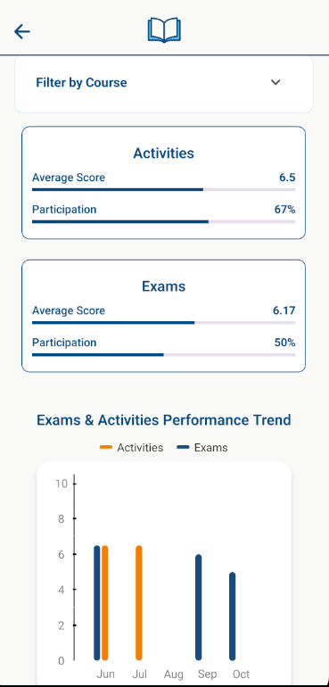
